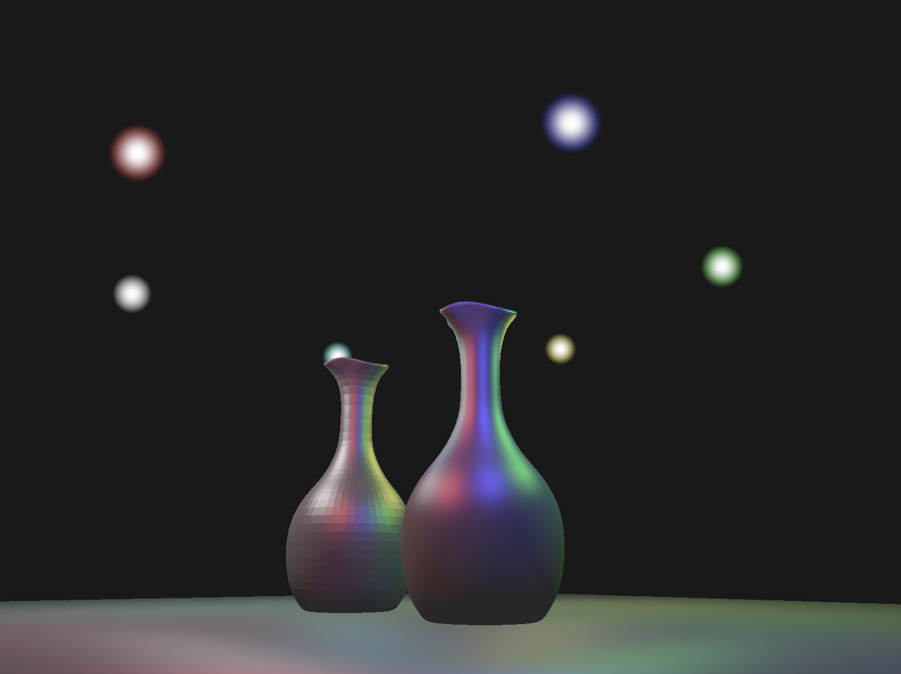

# Nemesis Rendering Engine



A real-time 3D rendering engine built using the Vulkan API in C++.

## Features
- real-time Blinn-Phong lighting with multiple dynamic point lights
- physically accurate inverse-square light attenuation
- specular highlights with configurable shininess
- Alpha blending and transparency
- Keyboard-driven camera controller
- 3D model loading via tinyobjloader

## Dependencies:
- Vulkan SDK
- GLFW
- GLM
- tinyobjloader
- CMake

## Build:
```bash
cmake -S . -B build
cmake --build build
./build/NreEngine

```

---
*Built following [Brendan Galea's Vulkan Game Engine Series] (https://www.youtube.com/watch?v=Y9U9IE0gVHA&list=PL8327DO66nu9qYVKLDmdLW_84-yE4auCR&index=1)*
